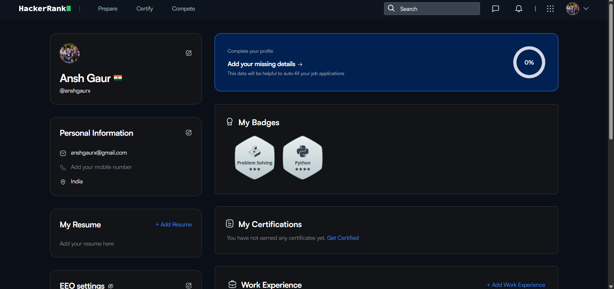
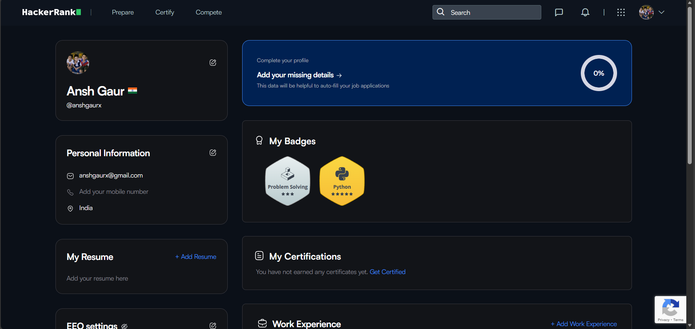

<!-- 🎯 Banner -->
<p align="center">
  
</p>

<!-- 👋 Introduction -->
<h1 align="center">
  
</h1>

<p align="center">
  <a href="mailto:anshgaurx@gmail.com">
    
  </a>
  <a href="https://github.com/Anshxgaur">
    
  </a>
  <a href="https://www.linkedin.com/in/anshgaurx">
    
  </a>
  <a href="https://wa.me/919149162265">
    
  </a>
</p>

---

<!-- 🖋️ Typing Intro Animation -->
[](https://git.io/typing-svg)
    
<!-- 🔥 GitHub Streak -->
### 🔥 GitHub Streakssss
[](https://github-readme-streak-stats-eight.vercel.app/demo/)

### 🔥 PROJECTS:
<h2 align="center">🗣️ NOVA - Intelligent Voice Assistant</h2>
<p align="center">
  <b>Your Personal Desktop Automation Companion</b><br>
  <i>Nova listens, understands, and acts — automating your daily tasks through natural speech.</i>
</p>

<div align="center">
  
  <br><br>
  
  
  
  
</div>

<br>

### 📌 Overview
**Nova** is a powerful Python-based voice assistant designed to bridge the gap between users and their operating systems. Instead of navigating menus or typing commands, users can control system settings, browse the web, and visualize data simply by speaking.

It leverages advanced libraries like `speech_recognition` and `pyttsx3` to provide a seamless, hands-free experience.

---

### 🚀 Key Features

| Category | Capabilities |
| :--- | :--- |
| **🎙️ Voice & Audio** | Uses Google Speech Recognition for high-accuracy command processing. Includes percentage-based **Volume Control** (e.g., "Set volume to 50%"). |
| **🖥️ System Control** | Dynamically adjusts **Screen Brightness** and manages windows (Minimize/Maximize). Includes voice-activated **System Shutdown**. |
| **🌐 Web Automation** | Performs **Google Searches**, reads **Wikipedia Summaries** aloud, and plays videos directly on **YouTube**. |
| **🖱️ Hands-Free I/O** | **Mouse Control**: Move cursor via coordinates.<br>**Voice Typing**: Dictate text directly into any active text field. |
| **📊 DataViz** | **Plotting Engine**: Speak a series of numbers, and Nova will generate and save a line plot using `matplotlib`. |

---

<details>
<summary><b>🛠️ Tech Stack & Modules (Click to Expand)</b></summary>
<br>

Nova is built using a modular Python architecture. Below are the core libraries powering the system:

* **`speech_recognition`**: The ears of the system; converts audio to text.
* **`pyttsx3`**: The voice of the system; offline text-to-speech conversion.
* **`pycaw`**: Provides low-level access to system audio interfaces.
* **`screen_brightness_control`**: Hardware-level monitor brightness adjustment.
* **`pyautogui`**: Simulates mouse movements and keystrokes.
* **`pywhatkit`**: Seamless integration for playing YouTube videos.
* **`matplotlib`**: Renders data visualizations from voice input.
* **`googlesearch-python`**: Fetches search results programmatically.

</details>

---

### ⚙️ Installation & Usage

1.  **Clone the Repository**
    ```bash
    git clone [https://github.com/AnshGaur/NOVA-Voice-Assistant.git](https://github.com/AnshGaur/NOVA-Voice-Assistant.git)
    cd NOVA-Voice-Assistant
    ```

2.  **Install Dependencies**
    ```bash
    pip install -r requirements.txt
    ```
    *(Note: You may need `PortAudio` installed on your system for microphone access)*

3.  **Run Nova**
    ```bash
    python nova.py
    ```

---

<p align="center">
  
  <i>"I'm listening..."</i>
</p>

<p align="center">
  
</p>

<h1 align="center">🌼 DAISY – Data Analysis & Intelligence System</h1>

<p align="center">
  <b>Transforming Raw Clinical Data into Lifesaving Insights</b><br>
  <i>An end-to-end Healthcare AI framework for disease prediction, patient risk stratification, and hospital resource optimization.</i>
</p>

<p align="center">
  
  
  
  
</p>

---

<h2 align="center">🚀 Project Showcase</h2>
<p align="center">
  <i>Explore my latest work in Healthcare AI and Desktop Automation. <br> Click on the buttons below to expand details!</i>
</p>

<table align="center" width="100%">
  <tr>
    <td width="50%" valign="top">
      <h3 align="center">🌼 DAISY</h3>
      <p align="center"><b>Healthcare Data Intelligence System</b></p>
      <div align="center">
        
        <br><br>
        
        
        
      </div>
      <br>
      <p align="center">
        An end-to-end data science framework designed to analyze complex medical datasets, predict disease outbreaks, and optimize hospital resource allocation.
      </p>
      <details>
        <summary><b>🔍 Click to View Features & Tech</b></summary>
        <br>
        <b>🏥 Key Capabilities:</b>
        <ul>
          <li><b>Disease Prediction:</b> ML models for Heart Disease & Diabetes risk.</li>
          <li><b>Patient Stratification:</b> Clustering patients by risk levels.</li>
          <li><b>Resource Forecasting:</b> Predicting ICU bed & staff requirements.</li>
          <li><b>Interactive Dashboard:</b> Real-time visualization of vitals.</li>
        </ul>
        <b>🛠️ Tech Stack:</b>
        <ul>
          <li>Pandas, NumPy (Data Processing)</li>
          <li>Scikit-Learn, XGBoost (Machine Learning)</li>
          <li>Matplotlib, Seaborn, Plotly (Visualization)</li>
        </ul>
      </details>
    </td>

    <td width="50%" valign="top">
      <h3 align="center">🗣️ NOVA</h3>
      <p align="center"><b>Intelligent Voice Assistant</b></p>
      <div align="center">
        
        <br><br>
        
        
        
      </div>
      <br>
      <p align="center">
        A Python-based voice assistant that listens, understands, and acts. Control your system volume, brightness, and web interactions strictly through voice commands.
      </p>
      <details>
        <summary><b>🔍 Click to View Features & Tech</b></summary>
        <br>
        <b>🎙️ Key Capabilities:</b>
        <ul>
          <li><b>System Control:</b> Adjust Volume & Brightness dynamically.</li>
          <li><b>Web Automation:</b> Voice-controlled Google Search & YouTube.</li>
          <li><b>Hands-Free IO:</b> Mouse cursor control & voice typing.</li>
          <li><b>Data Plotting:</b> Generate line plots from spoken numbers.</li>
          <li><b>App Launching:</b> Open specific applications instantly.</li>
        </ul>
        <b>🛠️ Modules Used:</b>
        <ul>
          <li><code>speech_recognition</code> (Input Processing)</li>
          <li><code>pyttsx3</code> (Text-to-Speech)</li>
          <li><code>pyautogui</code> & <code>pycaw</code> (System Control)</li>
          <li><code>matplotlib</code> (Data Viz)</li>
        </ul>
      </details>
    </td>
  </tr>
</table>

---

## 🏥 Problem Statement
The healthcare industry generates massive amounts of data daily—from patient electronic health records (EHR) to diagnostic imaging. However, this data is often underutilized due to its complexity. Key challenges include:
* **Predicting Disease Outbreaks:** Early detection of rising cases.
* **Patient Readmission:** Identifying high-risk patients likely to return to the hospital.
* **Resource Management:** Predicting bed and staff requirements.
* **Personalized Care:** Segmenting patients for targeted treatment plans.

**DAISY** addresses these challenges by processing historical data to forecast future health events and trends.

---

## 🧠 Key Features & Modules

### 1. Data Ingestion & Cleaning Pipeline
* Automated handling of missing clinical values (imputation based on medical norms).
* Standardization of medical units and terminologies.
* Anonymization of PII (Personally Identifiable Information) to simulate HIPAA/GDPR compliance.

### 2. Exploratory Data Analysis (EDA)
* **Demographic Analysis:** Distribution of age, gender, and location vs. disease prevalence.
* **Correlation Mapping:** Identifying relationships between lifestyle factors (BMI, Smoking) and health outcomes.
* **Geospatial Analysis:** (If applicable) Mapping disease hotspots.

### 3. Predictive Modeling Engine
* **Diagnosis Classification:** Logistic Regression/Random Forest models to detect presence of disease.
* **Readmission Forecasting:** Predicting if a patient will return within 30 days.
* **Survival Analysis:** Estimating recovery timeframes.

### 4. Interactive Health Dashboard
* Visualizing patient vitals and population health metrics in real-time.
* Drill-down capabilities for specific demographics.

---

## ⚙️ Installation & Usage

### 1️⃣ Prerequisites
Ensure you have the following installed:
* **Python 3.8+** ([Download Here](https://www.python.org/downloads/))
* **Git** (for cloning the repository)

### 2️⃣ Clone the Repository
Open your terminal or command prompt and run:
```bash
git clone [https://github.com/AnshGaur/DAISY-Healthcare.git](https://github.com/AnshGaur/DAISY-Healthcare.git)
cd DAISY-Healthcare


--- ## 🧠 Top Languages & Tools
#### 💻 Programming Languages  
#### 📊 Data Science & ML Libraries 
 


 
 
#### 🧰 Tools & Platforms
 
 
  
 
#### 🌐 Coding Platforms 
[](https://leetcode.com/anshgaurx/)
[](https://www.hackerrank.com/anshgaurx) 

<!-- 📈 GitHub Activity Graph -->
### 📈 GitHub Activity Graph


---
## 🥇 Certifications & Badges

<table align="center">

<!-- Row 1 -->
<tr>
  <td align="center">
    <br/>
    <sub><b>Data analysis with python.png</b></sub>
  </td>
  <td align="center">
    <br/>
    <sub><b>data base and sql.png</b></sub>
  </td>
  <td align="center">
    <br/>
    <sub><b>Data Science Methodology</b></sub>
  </td>
  <td align="center">
    <br/>
    <sub><b>intro to snowpark.png</b></sub>
  </td>
    <td align="center">
    <br/>
    <sub><b>MATHS FOR COMPUTER SCIENCE</b></sub>
  </td>
</tr>

<!-- Row 2 -->
<tr>
  <td align="center">
    <br/>
    <sub><b>linear regression using python.png</b></sub>
  </td>
  <td align="center">
    <br/>
    <sub><b>open ai.png</b></sub>
  </td>
  <td align="center">
    <br/>
    <sub><b>python for data science.png</b></sub>
  </td>
  <td align="center">
    <br/>
    <sub><b>python project for data science.png</b></sub>
  </td>
  <td align="center">
    <br/>
    <sub><b>Presentaion by canva.png</b></sub>
  
</tr>

<!-- Row 3  -->
<tr>
  <td align="center">
    <br/>
    <sub><b>snowflakes.png</b></sub>
  </td>

  <td align="center">
    <br/>
    <sub><b>Tools for data science.png</b></sub>
  </td>
    <td align="center">
    <br/>
    <sub><b>what is data science.png</b></sub>
  </td>
    <td align="center">
    <br/>
    <sub><b>Generative AI: Elevate Your Data Science Career</b></sub>
  </td>
    <td align="center">
    <br/>
    <sub><b>Data science carieer guide</b></sub>


</table>


---


<!-- 🛠️ Tech Stack -->
## 🛠️ Tech Stack

<p align="center">
  
  
  
  
  
  
  
  
</p>

<p align="center">
  
  
  
  
  
</p>

<!-- 🎏 Animated Banner -->


#### 📊 3D Contribution Calendar


### 🏆 Coding Platforms
[](https://leetcode.com/anshgaurx/)
[](https://www.hackerrank.com/anshgaurx)
[](https://www.kaggle.com/anshgaurx)

## 🏆 Progress Showcase
LEETCODE
<div style="display: flex; justify-content: space-around; align-items: flex-start; flex-wrap: wrap; gap: 20px;">


🧩 Coding Profiles
---


<p align="center">
  
  
</p>

<p align="center">
  <a href="https://leetcode.com/anshgaurx/">🔗 LeetCode Profile</a> |
  <a href="https://www.hackerrank.com/anshxgaur">🔗 HackerRank Profile</a>
</p>

📅 Updated: Jan 24, 2026  
---

<!-- 👁️ Visitor Counter -->


---
## 🧠 Top Skills

 


## 📊 Visitors


---

### 📊 GitHub Stats
<p align="center">
  
</p>

---

<!-- 🧾 Footer -->
📌 Built with ❤️ by Ansh Gaur

