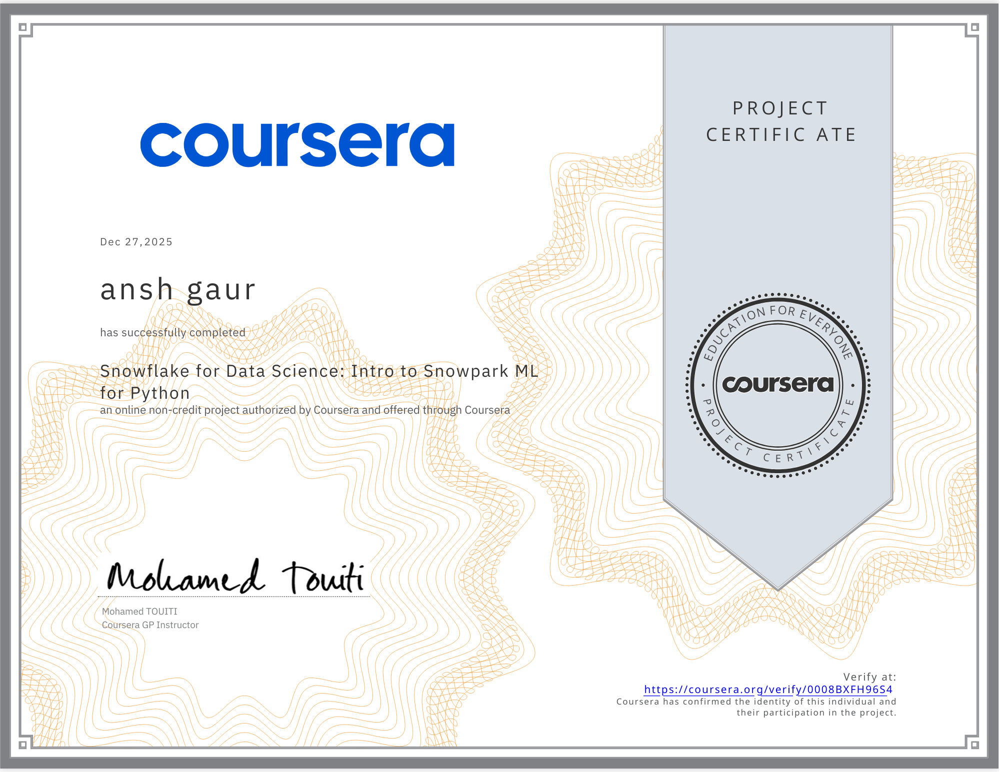

<!-- 🎯 Banner -->

  

<!-- 👋 Introduction -->
<h1 align="center">
  
</h1>

  
  

---

<!-- 🖋️ Typing Intro Animation -->

---

<!-- 🔥 GitHub Streak -->
### 🔥 GitHub Streak

--- ## 🧠 Top Languages & Tools
#### 💻 Programming Languages  
#### 📊 Data Science & ML Libraries 
 

 
 
#### 🧰 Tools & Platforms
 
 
  
 
#### 🌐 Coding Platforms 

 

<!-- 📈 GitHub Activity Graph -->
### 📈 GitHub Activity Graph

---
## 🥇 Certifications & Badges

<table align="center">

<!-- Row 1 -->
<tr>
  <td align="center">
     
    <b>Data analysis with python.png</b>
  </td>
  <td align="center">
     
    <b>data base and sql.png</b>
  </td>
  <td align="center">
     
    <b>Data Science Methodology</b>
  </td>
  <td align="center">
     
    <b>intro to snowpark.png</b>
  </td>
</tr>

<!-- Row 2 -->
<tr>
  <td align="center">
     
    <b>linear regression using python.png</b>
  </td>
  <td align="center">
     
    <b>open ai.png</b>
  </td>
  <td align="center">
     
    <b>python for data science.png</b>
  </td>
  <td align="center">
     
    <b>python project for data science.png</b>
  </td>
</tr>

<!-- Row 3 (last one centered) -->
<tr>
  <td align="center">
     
    <b>snowflakes.png</b>
  </td>

  <td align="center">
     
    <b>Tools for data science.png</b>
  </td>
    <td align="center">
     
    <b>what is data science.png</b>
  </td>

</table>

---

<!-- 🛠️ Tech Stack -->
## 🛠️ Tech Stack

  
  
  
  
  
  
  
  

  
  
  
  
  

<!-- 🎏 Animated Banner -->

### 🧱 3D Contribution Calendar

### 🏆 Coding Platforms

## 🏆 Progress Showcase

<!-- LeetCode Section -->

  <h3>LeetCode Progress</h3>
  <a href="https://leetcode.com/anshgaurx">anshgaurx</a> 
  

<!-- HackerRank Section -->

  <h3>HackerRank Banner</h3>
  
HackerRank ID: <code>anshgaurx</code>

  

<!-- 👁️ Visitor Counter -->

---

<!-- 🧾 Footer -->
📌 Built with ❤️ by Ansh Gaur

