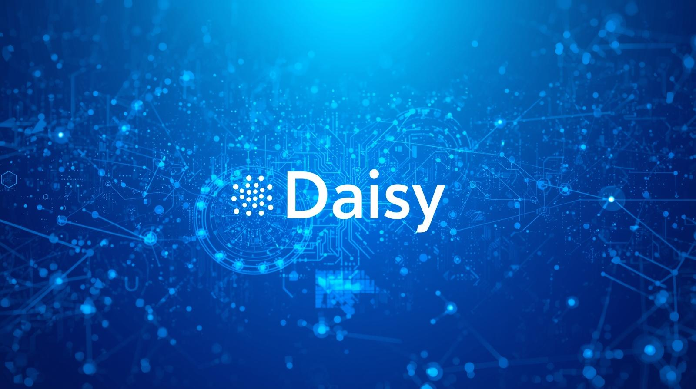
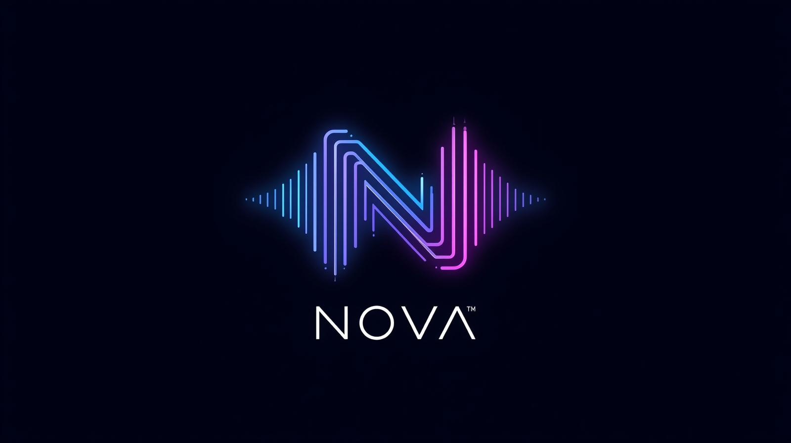
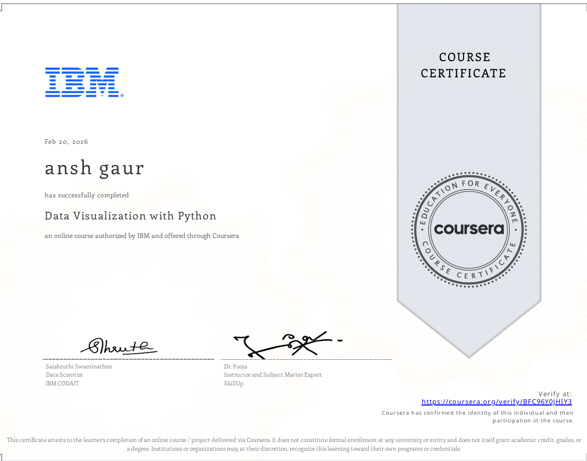
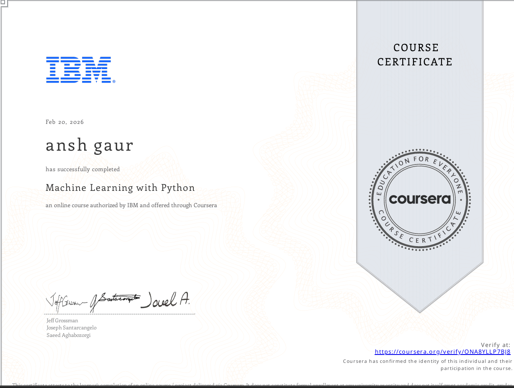
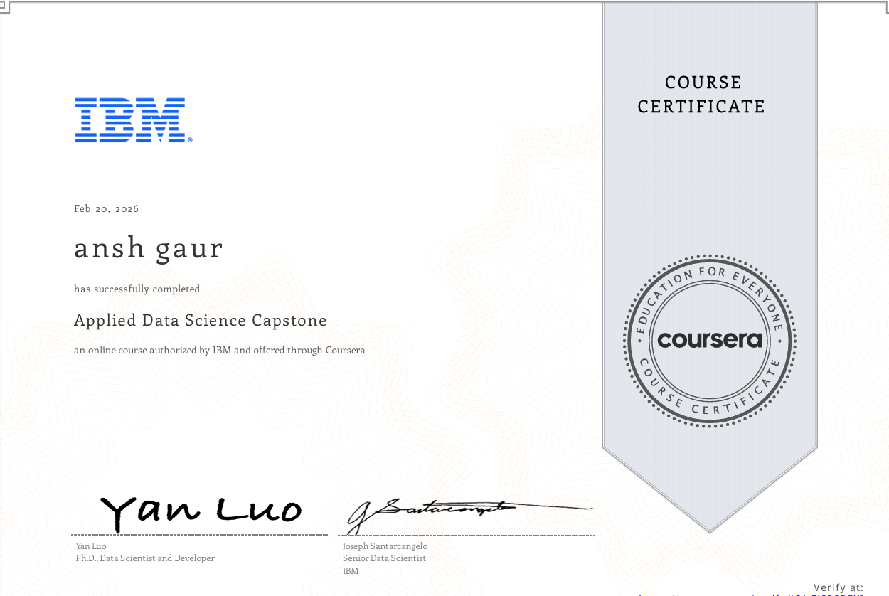
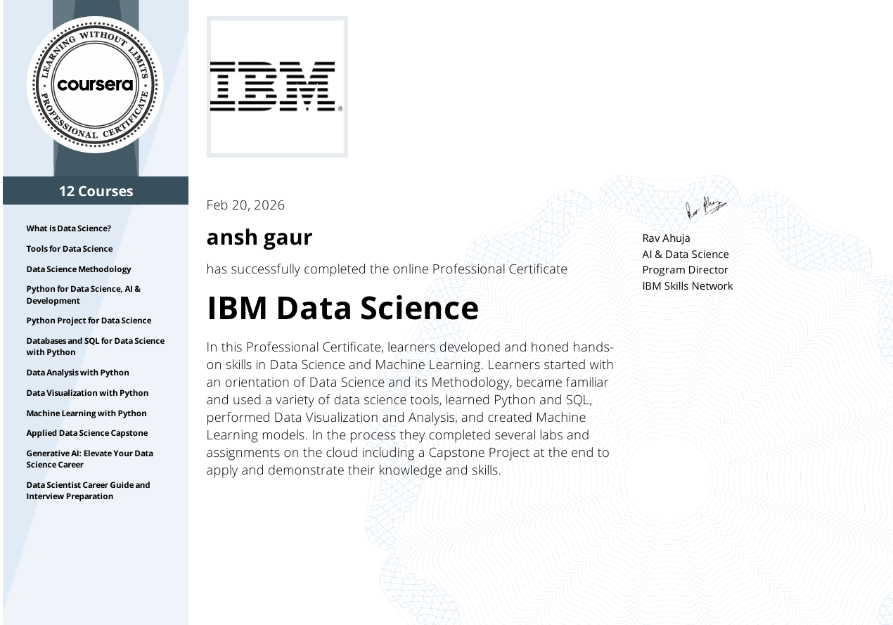
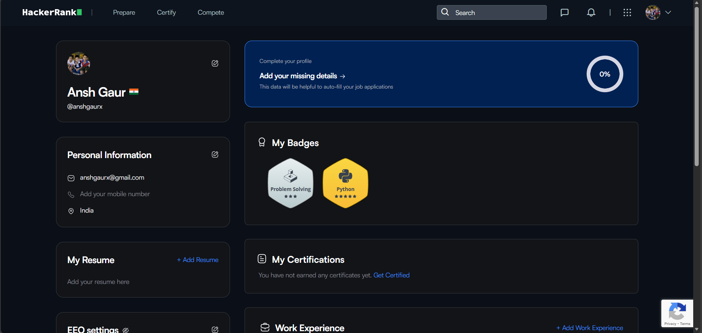
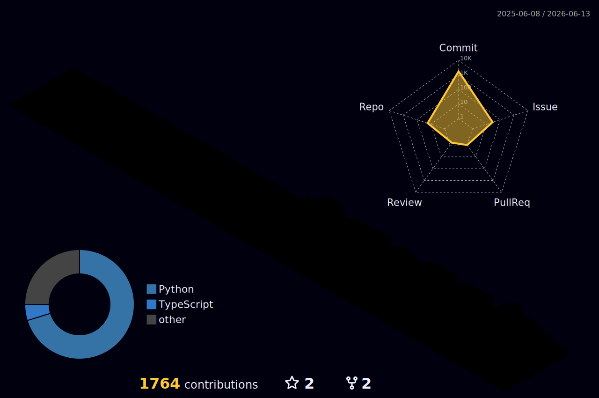

<!-- 🎯 Banner -->
<p align="center">
  
</p>

<!-- 👋 Introduction -->
<h1 align="center">
  
</h1>

<p align="center">
  <a href="mailto:anshgaurx@gmail.com">
    
  </a>
  <a href="https://github.com/Anshxgaur">
    
  </a>
  <a href="https://www.linkedin.com/in/anshgaurx">
    
  </a>
  <a href="https://wa.me/919149162265">
    
  </a>
</p>

---

<!-- 🖋️ Typing Intro Animation -->
[](https://git.io/typing-svg)
    
<!-- 🔥 GitHub Streak -->
### 🔥 GitHub Streakssss
[](https://git.io/streak-stats)

---
### 🔥 top language
[](https://github.com/anshxgaur)

### 🔥 PROJECTS:
# 🚀 AI & Automation Portfolio

<p align="center">
  <b>Ansh Gaur</b><br>
  <i>Showcasing specialized work in Healthcare Intelligence & Voice Automation</i>
</p>

<p align="center">
  
  
  
</p>

---

<table width="100%">
<tr>
<td width="50%" align="center">

## 🌼 DAISY




</td>

<td width="50%" align="center">

## 🗣️ NOVA




</td>
</tr>

<tr>
<td valign="top">

### Healthcare Data Intelligence System

An end-to-end AI framework designed to analyze complex medical datasets, predict disease outbreaks, and optimize hospital resource allocation.

**🏥 Key Features**

- **Disease Prediction:** Heart Disease & Diabetes risk modeling  
- **Interactive Dashboard:** Real-time patient vitals via Streamlit  
- **Risk Stratification:** Categorizing patients by urgency  

</td>

<td valign="top">

### Intelligent Voice Assistant

A desktop automation companion that listens, understands, and acts. Control your system volume, brightness, and web interactions strictly through voice.

**🎙️ Key Features**

- **System Control:** Voice-activated Volume & Brightness  
- **Web Automation:** Google Search & YouTube playback  
- **Hands-Free:** Mouse control & voice typing  

</td>
</tr>

<tr>
<td valign="top">

<details>
<summary><b>⚙️ How to Run DAISY</b></summary>

```bash
# 1. Clone Repo
git clone https://github.com/AnshGaur/DAISY.git
cd DAISY

# 2. Create Virtual Environment
python -m venv venv

# Activate Environment
source venv/Scripts/activate   # Git Bash / Linux / macOS
venv\Scripts\activate          # Windows CMD / PowerShell

# 3. Install Dependencies
pip install -r requirements.txt

# 4. Launch App
streamlit run app.py
```

</details>

<br>

<details>
<summary><b>🛠️ Tech Stack</b></summary>

- `pandas`
- `numpy`
- `scikit-learn`
- `plotly`
- `seaborn`
- `streamlit`

</details>

</td>

<td valign="top">

<details>
<summary><b>⚙️ How to Run NOVA</b></summary>

```bash
# 1. Clone Repo
git clone https://github.com/AnshGaur/NOVA.git
cd NOVA

# 2. Create Virtual Environment
python -m venv venv

# Activate Environment
source venv/Scripts/activate   # Git Bash / Linux / macOS
venv\Scripts\activate          # Windows CMD / PowerShell

# 3. Install Dependencies
pip install -r requirements.txt

# 4. Launch Assistant
python app.py
```

</details>

<br>

<details>
<summary><b>🛠️ Tech Stack</b></summary>

- `speech_recognition`
- `pyttsx3`
- `pyautogui`
- `pyaudio`

</details>

</td>
</tr>

</table>

---

<p align="center">
  
  
  <br>
  <sub><i>Empowering users through Data & Voice</i></sub>
</p>


## 🧠 Top Languages & Tools
#### 💻 Programming Languages  
#### 📊 Data Science & ML Libraries 
 


 
 
#### 🧰 Tools & Platforms
 
 
  
 
#### 🌐 Coding Platforms 
[](https://leetcode.com/anshgaurx/)
[](https://www.hackerrank.com/anshgaurx) 

---
### 📈 GitHub Activity Graph

---
## 🥇 Certifications & Badges

<!-- IBM Data Science -->
<h2 align="center">IBM Data Science</h2>
<p align="center">13 Certificates</p>

<table align="center">

  <!-- Row 1 -->
  <tr>
    <td align="center"><br/><sub><b>What is Data Science?</b></sub></td>
    <td align="center"><br/><sub><b>Tools for Data Science</b></sub></td>
    <td align="center"><br/><sub><b>Data Science Methodology</b></sub></td>
    <td align="center"><br/><sub><b>Python for Data Science</b></sub></td>
    <td align="center"><br/><sub><b>Databases and SQL</b></sub></td>
  </tr>

  <!-- Row 2 -->
  <tr>
    <td align="center"><br/><sub><b>Data Analysis with Python</b></sub></td>
    <td align="center"><br/><sub><b>Data Visualization</b></sub></td>
    <td align="center"><br/><sub><b>Machine Learning</b></sub></td>
    <td align="center"><br/><sub><b>Applied Data Science Capstone</b></sub></td>
    <td align="center"><br/><sub><b>Gen AI: Elevate Your Career</b></sub></td>
  </tr>

  <!-- Row 3 -->
  <tr>
    <td align="center"><br/><sub><b>Career Guide</b></sub></td>
    <td align="center"><br/><sub><b>IBM Data Science Certificate</b></sub></td>
    <td></td><td></td><td></td>
  </tr>
</table>


<!-- IBM Generative AI Engineering -->
<h2 align="center">IBM Generative AI Engineering</h2>
<p align="center">17 Certificates</p>

<table align="center">

  <!-- Row 1 -->
  <tr>
    <td align="center"><br/><sub><b>Introduction to AI</b></sub></td>
    <td align="center"><br/><sub><b>Gen AI: Intro & Applications</b></sub></td>
    <td align="center"><br/><sub><b>Prompt Engineering Basics</b></sub></td>
    <td align="center"><br/><sub><b>Python for Data Science</b></sub></td>
    <td align="center"><br/><sub><b>AI Apps with Flask</b></sub></td>
  </tr>

  <!-- Row 2 -->
  <tr>
    <td align="center"><br/><sub><b>Gen AI-Powered Apps</b></sub></td>
    <td align="center"><br/><sub><b>Data Analysis with Python</b></sub></td>
    <td align="center"><br/><sub><b>Machine Learning</b></sub></td>
    <td align="center"><br/><sub><b>Deep Learning with Keras</b></sub></td>
    <td align="center"><br/><sub><b>LLMs Architecture</b></sub></td>
  </tr>

  <!-- Row 3 -->
  <tr>
    <td align="center"><br/><sub><b>NLP Foundational Models</b></sub></td>
    <td align="center"><br/><sub><b>Language Modeling w/ Transformers</b></sub></td>
    <td align="center"><br/><sub><b>Fine-Tuning Transformers</b></sub></td>
    <td align="center"><br/><sub><b>Advanced Fine-Tuning</b></sub></td>
    <td align="center"><br/><sub><b>AI Agents w/ RAG</b></sub></td>
  </tr>

  <!-- Row 4 -->
  <tr>
    <td align="center"><br/><sub><b>Project: RAG & LangChain</b></sub></td>
    <td align="center"><br/><sub><b>IBM Gen AI Certificate</b></sub></td>
    <td></td><td></td><td></td>
  </tr>
</table>


<!-- Extras -->
<h2 align="center">Extras</h2>
<p align="center">5 Certificates</p>

<table align="center">
  <tr>
    <td align="center"><br/><sub><b>Maths for Machine Learning</b></sub></td>
    <td align="center"><br/><sub><b>Databricks ML Fundamentals</b></sub></td>
    <td align="center"><br/><sub><b>Maths for Computer Science</b></sub></td>
    <td align="center"><br/><sub><b>Canva Presentation Design</b></sub></td>
    <td align="center"><br/><sub><b>Gen AI Transform Your Organization</b></sub></td>
  </tr>
</table>


<!-- Gen AI for Data Engineering -->
<h2 align="center">Gen AI for Data Engineering</h2>
<p align="center">5 Certificates</p>

<table align="center">
  <tr>
    <td align="center"><br/><sub><b>Gen AI Introduction & Application</b></sub></td>
    <td align="center"><br/><sub><b>Gen AI Prompt Engineering</b></sub></td>
    <td align="center"><br/><sub><b>Gen AI Elevate Your Career</b></sub></td>
    <td align="center"><br/><sub><b>Gen AI for Data Science</b></sub></td>
    <td align="center"><br/><sub><b>Final Gen AI Certificate</b></sub></td>
  </tr>
</table>


<!-- 🛠️ Tech Stack -->
## 🛠️ Tech Stack

<p align="center">
  
  
  
  
  
  
  
  
</p>

<p align="center">
  
  
  
  
  
</p>

<!-- 🎏 Animated Banner -->


### 🏆 Coding Platforms
[](https://leetcode.com/anshgaurx/)
[](https://www.hackerrank.com/anshgaurx)
[](https://www.kaggle.com/anshgaurx)

## 🏆 Progress Showcase
LEETCODE
<div style="display: flex; justify-content: space-around; align-items: flex-start; flex-wrap: wrap; gap: 20px;">


🧩 Coding Profiles
---


<p align="center">
  
  
</p>

<p align="center">
  <a href="https://leetcode.com/anshgaurx/">🔗 LeetCode Profile</a> |
  <a href="https://www.hackerrank.com/anshxgaur">🔗 HackerRank Profile</a>
</p>

📅 Updated: Mar 09, 2026  
---


### 🌈 3D Contribution Graph
<p align="center">
  
</p>


<picture><source media="(prefers-color-scheme: dark)" srcset="https://raw.githubusercontent.com/anshxgaur/anshxgaur/output/github-snake-dark.svg"><source media="(prefers-color-scheme: light)" srcset="https://raw.githubusercontent.com/anshxgaur/anshxgaur/output/github-snake.svg"></picture>


