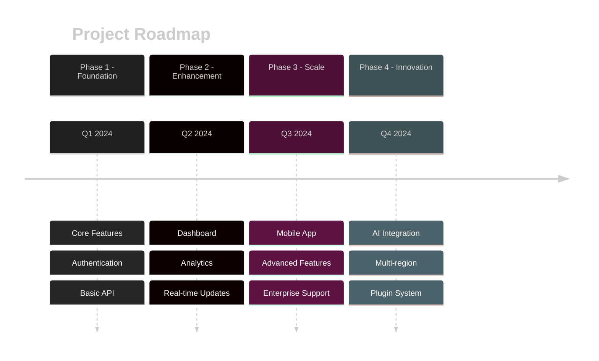

<p align="center">
  
</p>


<!-- Typing SVG -->
<p align="center">
  
</p>

<!-- Animated Badges -->
<p align="center">
  
  
  
  
</p>

<!-- Social Badges with Animation -->
<p align="center">
  <a href="https://github.com/yourusername/yourproject/stargazers">
    
  </a>
  <a href="https://github.com/yourusername/yourproject/network/members">
    
  </a>
  <a href="https://github.com/yourusername/yourproject/issues">
    
  </a>
  <a href="https://twitter.com/intent/tweet?text=Check%20out%20this%20awesome%20project">
    
  </a>
</p>

<!-- Animated Demo GIF -->
<br>

<br>

<!-- Fancy Divider -->


</div>

## 🎯 What is This?

<table>
<tr>
<td width="50%">

### 💡 The Problem
Traditional solutions are:
- ⏱️ **Slow** to set up
- 🔧 **Complex** to configure  
- 💸 **Expensive** to maintain
- 📉 **Hard** to scale

</td>
<td width="50%">

### ✨ Our Solution
We provide:
- ⚡ **Instant** deployment
- 🎨 **Simple** configuration
- 💰 **Free** & open-source
- 📈 **Auto-scaling** built-in

</td>
</tr>
</table>

<div align="center">

<!-- Feature Showcase with Icons -->


## ⚡ Features That Will Blow Your Mind

</div>

<table>
<tr>
<td align="center" width="25%">

<br><br>
<b>Lightning Fast</b>
<br>
Optimized for speed
<br>
⚡ Sub-second loading
</td>
<td align="center" width="25%">

<br><br>
<b>Container Ready</b>
<br>
Deploy anywhere
<br>
🐳 Docker support
</td>
<td align="center" width="25%">

<br><br>
<b>Auto Scaling</b>
<br>
Handles any load
<br>
📈 K8s native
</td>
<td align="center" width="25%">

<br><br>
<b>Modern API</b>
<br>
GraphQL & REST
<br>
🔌 Full-featured
</td>
</tr>
</table>

<div align="center">


## 🛠️ Tech Stack

</div>

<p align="center">
  <a href="https://skillicons.dev">
    
  </a>
</p>

<!-- Additional Tech Badges -->
<p align="center">
  
  
  
  
  
  
</p>

<div align="center">


## 🚀 Quick Start

</div>

<!-- Installation Steps with Visual Cards -->
<table>
<tr>
<td>

### Step 1️⃣ - Clone the Repo
```bash
git clone https://github.com/yourusername/yourproject.git
cd yourproject
```

</td>
</tr>
<tr>
<td>

### Step 2️⃣ - Install Dependencies
```bash
npm install
# or
yarn install
# or
pnpm install
```

</td>
</tr>
<tr>
<td>

### Step 3️⃣ - Configure Environment
```bash
cp .env.example .env
# Edit .env with your settings
```

</td>
</tr>
<tr>
<td>

### Step 4️⃣ - Run the App
```bash
npm run dev
# 🎉 Visit http://localhost:3000
```

</td>
</tr>
</table>

<div align="center">


## 📊 GitHub Stats & Activity

</div>

<div align="center">
  
  
</div>

<div align="center">
  
  
</div>

<div align="center">


## 📸 Screenshots & Demo

</div>

<!-- Screenshot Gallery -->
<details>
<summary>🖼️ Click to view screenshots</summary>
<br>

| Home Screen | Dashboard | Analytics |
|-------------|-----------|-----------|
|  |  |  |

| Settings | Profile | Admin Panel |
|----------|---------|-------------|
|  |  |  |

</details>

<div align="center">


## 💻 Usage Examples

</div>

<!-- Code Examples with Syntax Highlighting -->
<table>
<tr>
<td width="50%">

### Basic Usage 🔰

```javascript
import { AwesomeProject } from 'your-project';

const app = new AwesomeProject({
  apiKey: 'your-api-key',
  environment: 'production'
});

const result = await app.doSomething();
console.log(result);
```

</td>
<td width="50%">

### Advanced Usage 🚀

```javascript
import { AwesomeProject } from 'your-project';

const app = new AwesomeProject({
  apiKey: process.env.API_KEY,
  options: {
    cache: true,
    timeout: 5000,
    retries: 3
  },
  plugins: [
    analytics(),
    logger(),
    customPlugin()
  ]
});

await app.init();
```

</td>
</tr>
</table>

<div align="center">


## 🗺️ Roadmap

</div>



<!-- Progress Bars -->
<div align="center">

### Current Sprint Progress


</div>

<div align="center">


## 🏗️ Architecture

```mermaid
%%{init: {'theme':'dark', 'themeVariables': { 'primaryColor': '#00D9FF'}}}%%
graph TB
    A[Client/Browser] -->|HTTP/WebSocket| B[Load Balancer]
    B --> C[API Gateway]
    C --> D[Auth Service]
    C --> E[Business Logic]
    E --> F[Database]
    E --> G[Cache Layer]
    E --> H[Message Queue]
    H --> I[Workers]
    I --> J[External APIs]
    
    style A fill:#1a1a1a,stroke:#00D9FF,stroke-width:2px
    style B fill:#1a1a1a,stroke:#00D9FF,stroke-width:2px
    style C fill:#1a1a1a,stroke:#00D9FF,stroke-width:2px
    style D fill:#1a1a1a,stroke:#FF6B6B,stroke-width:2px
    style E fill:#1a1a1a,stroke:#00D9FF,stroke-width:2px
    style F fill:#1a1a1a,stroke:#4ECDC4,stroke-width:2px
    style G fill:#1a1a1a,stroke:#FFE66D,stroke-width:2px
    style H fill:#1a1a1a,stroke:#95E1D3,stroke-width:2px
    style I fill:#1a1a1a,stroke:#F38181,stroke-width:2px
    style J fill:#1a1a1a,stroke:#AA96DA,stroke-width:2px
```

</div>



<div align="center">


## 📈 Performance Metrics

</div>

<table align="center">
<tr>
<td align="center">
  
  <br>
  <sub>Lightning Fast</sub>
</td>
<td align="center">
  
  <br>
  <sub>Highly Available</sub>
</td>
<td align="center">
  
  <br>
  <sub>High Throughput</sub>
</td>
<td align="center">
  
  <br>
  <sub>Well Tested</sub>
</td>
</tr>
</table>

<div align="center">


## 🤝 Contributing

</div>

<div align="center">

We ❤️ contributions! Here's how you can help:

<table>
<tr>
<td align="center" width="33%">
  
### 🐛 Report Bugs
Found a bug? 
<br>
[Create an Issue](https://github.com/yourusername/yourproject/issues/new?template=bug_report.md)

</td>
<td align="center" width="33%">

### 💡 Request Features
Have an idea?
<br>
[Request Feature](https://github.com/yourusername/yourproject/issues/new?template=feature_request.md)

</td>
<td align="center" width="33%">

### 🔧 Submit PRs
Want to code?
<br>
[Contribution Guide](CONTRIBUTING.md)

</td>
</tr>
</table>

</div>

<!-- Contribution Graph -->
<div align="center">
  
</div>

<div align="center">


## 📜 License

</div>

<div align="center">

This project is licensed under the **MIT License**

[](https://opensource.org/licenses/MIT)

See [LICENSE](LICENSE) for more information

</div>

<div align="center">


## 📞 Connect With Us

</div>

<div align="center">

[](https://yourwebsite.com)
[](https://linkedin.com/in/yourprofile)
[](https://twitter.com/yourhandle)
[](https://discord.gg/yourserver)
[](mailto:your.email@example.com)

</div>

<div align="center">


## 💖 Support Us

</div>

<div align="center">

If you find this project useful, please consider:

<a href="https://www.buymeacoffee.com/yourusername" target="_blank">
  
</a>

<br><br>

⭐ **Star this repository** if you like it!

<br>


</div>

<div align="center">


## 🙏 Acknowledgments

</div>

<div align="center">

Special thanks to all the amazing people and projects that made this possible!

<!-- Trophy Section -->


</div>

---

<div align="center">

### Made with ❤️ by [Your Name](https://github.com/yourusername)


</div>
