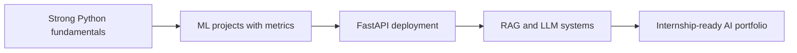
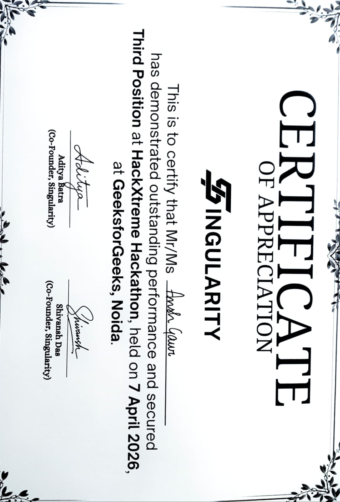
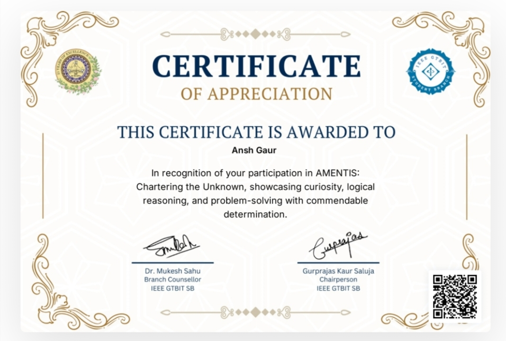

  

  

  
  
  
  

----

## About Me

I am a B.Tech Computer Science and Engineering(data science)student specializing in Data Science at PSIT Kanpur. I build practical AI systems with Python, machine learning, FastAPI, data pipelines, dashboards, and early-stage LLM/RAG architectures.

My current focus is becoming internship-ready for AI/ML Engineering, Data Science, Python Backend, and Generative AI roles.

<table>
  <tr>
    <td><b>Current stage</b></td>
    <td>2nd-year CSE - Data Science undergraduate</td>
  </tr>
  <tr>
    <td><b>Core stack</b></td>
    <td>Python, SQL, TypeScript, FastAPI, Flask, Pandas, NumPy, Scikit-learn</td>
  </tr>
  <tr>
    <td><b>AI interests</b></td>
    <td>Machine learning, NLP, anomaly detection, RAG, local LLM systems, analytics dashboards</td>
  </tr>
  <tr>
    <td><b>Open to</b></td>
    <td>Remote internships and Delhi/NCR/Meerut/Kanpur office or hybrid internships</td>
  </tr>
</table>

---
### Project Breakdown

| Project | What It Solves | Tech / Concepts | Why It Matters |
|---|---|---|---|
| [Nexus Workspace](https://github.com/anshxgaur/nexus) | Self-hosted AI-powered corporate workspace with team chat, meetings, live transcription, RAG search, and task extraction. | FastAPI, React, Tauri, TailwindCSS, Zustand, PostgreSQL, Redis, Qdrant, Whisper, LiveKit, Ollama, WebSockets | Shows system design thinking: backend APIs, real-time communication, vector search, local LLM integration, and multi-service architecture. |
| [DAISY](https://github.com/anshxgaur/DAISY) | Healthcare data intelligence system for EDA, disease prediction, risk stratification, and clinical decision support. | Python, Pandas, NumPy, Scikit-learn, Matplotlib, Seaborn, ML pipelines, model evaluation | Strong fit for data science internships because it connects ML models to a real domain problem with interpretable outcomes. |
| [NOVA](https://github.com/anshxgaur/NOVA) | Personal AI assistant architecture focused on local inference, voice interaction, security checks, and task orchestration. | TypeScript, AI architecture, STT/TTS pipeline, prompt-injection defense, modular orchestration | Demonstrates interest in GenAI beyond prompting: local-first design, secure AI flow, and agent-like task routing. |
| [F1 Data Analytics](https://github.com/anshxgaur/F1) | Formula 1 analytics platform for tire degradation, pit-window reasoning, and driver performance comparison. | TypeScript, Next.js, data visualization, analytics dashboards, strategy modeling | Shows you can turn complex datasets into interactive decision-support products. |

---

## What I Build:

<table>
  <tr>
    <td width="33%">
      <h3>Machine Learning Pipelines</h3>
      
EDA, preprocessing, feature engineering, model training, evaluation, and deployment-ready APIs.

    </td>
    <td width="33%">
      <h3>LLM and RAG Systems</h3>
      
Document search, embeddings, vector databases, prompt design, local LLM flows, and retrieval-based assistants.

    </td>
    <td width="33%">
      <h3>Data Products</h3>
      
Dashboards, analytics workflows, visual reports, and API-backed tools that make data easier to act on.

    </td>
  </tr>
</table>

---

## Tech Stack

  

  
  
  
  
  
  
  

---

## Internship Readiness

| Target Role | I Can Show | Next Skill I Am Sharpening |
|---|---|---|
| AI/ML Intern | ML pipelines, anomaly detection, healthcare analytics, model evaluation | Better experiment tracking and model comparison |
| GenAI / LLM Intern | RAG architecture, local LLM workflow, prompt-safety thinking | LangChain/LlamaIndex projects with vector search |
| Python Developer Intern | FastAPI/Flask APIs, automation scripts, data processing | Testing, Docker, and production-style API structure |
| Data Science Intern | EDA, visualizations, predictive modeling, SQL basics | Stronger SQL case studies and dashboard deployment |

---

## GitHub Analytics

  

  

---

## Generated Profile Assets

### Contribution Snake

<picture>
  <source media="(prefers-color-scheme: dark)" srcset="https://raw.githubusercontent.com/anshxgaur/anshxgaur/output/github-contribution-grid-snake-dark.svg" />
  <source media="(prefers-color-scheme: light)" srcset="https://raw.githubusercontent.com/anshxgaur/anshxgaur/output/github-contribution-grid-snake.svg" />
  
</picture>
---

## Certifications and Achievements

- IBM Data Science Professional Certificate
- IBM Generative AI Engineering Certificate
- Generative AI for Data Science
- Mathematics for Machine Learning
- 3rd Position, GGSIPU Hackathon HACKXTREME
- Participant: PROTODASH IISc, CODEFEST NIT Durgapur, ECLIPSE 6.0 Thapar Institute

---

## Current Mission

---

  <b>Open to AI/ML, Data Science, Python Developer, and GenAI internships.</b>
   
  <a href="mailto:anshgaurx@gmail.com">anshgaurx@gmail.com</a> |
  <a href="https://www.linkedin.com/in/ansh-gaur-46b7a4378/">LinkedIn</a> |
  <a href="https://github.com/anshxgaur">GitHub</a>

  

</picture>

  

  

<!-- CERTIFICATES-AND-HACKATHONS-START -->

## Certifications and Hackathon Highlights

  
  

<table>
  <tr>
    <td width="25%" align="center">
      
       
      <b>AI / Data Science</b>
    </td>
    <td width="25%" align="center">
      
       
      <b>ML / GenAI</b>
    </td>
    <td width="25%" align="center">
      
       
      <b>Hackathon</b>
    </td>
    <td width="25%" align="center">
      
       
      <b>IGDTU Event</b>
    </td>
  </tr>
  <tr>
    <td width="25%" align="center">
      
       
      <b>IISc Bangalore</b>
    </td>
    <td width="25%" align="center">
      
       
      <b>NIT Durgapur</b>
    </td>
    <td width="25%" align="center">
      
       
      <b>NIT Durgapur</b>
    </td>
    <td width="25%" align="center">
      
       
      <b>Growing Portfolio</b>

  </tr>
</table>

### What These Prove

<table>
  <tr>
    <td align="center" width="25%">
      <b>Consistency</b>
       
      Learning through courses, projects, and events.
    </td>
    <td align="center" width="25%">
      <b>Execution</b>
       
      Building solutions within limited time during hackathons.
    </td>
    <td align="center" width="25%">
      <b>AI Focus</b>
       
      Working toward ML, GenAI, and data science roles.
    </td>
    <td align="center" width="25%">
      <b>Growth Mindset</b>
       
      Actively competing, learning, and improving.
    </td>
  </tr>
</table>

<!-- CERTIFICATES-AND-HACKATHONS-END -->

## Daily AI Insight

<!--QUOTE-START-->

  

<!--QUOTE-END-->

