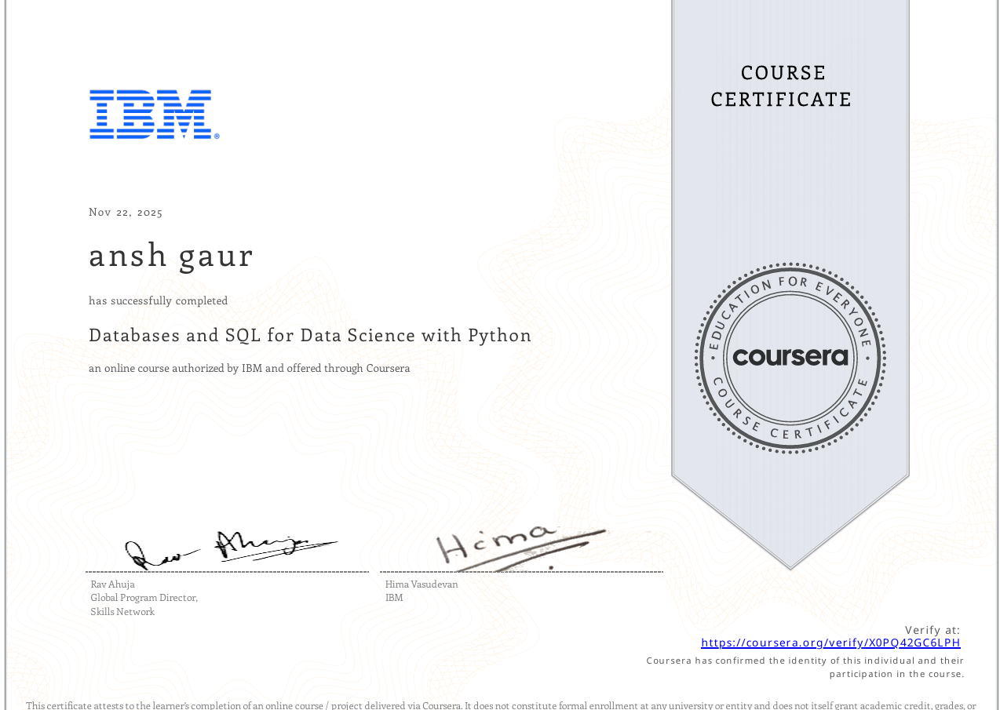
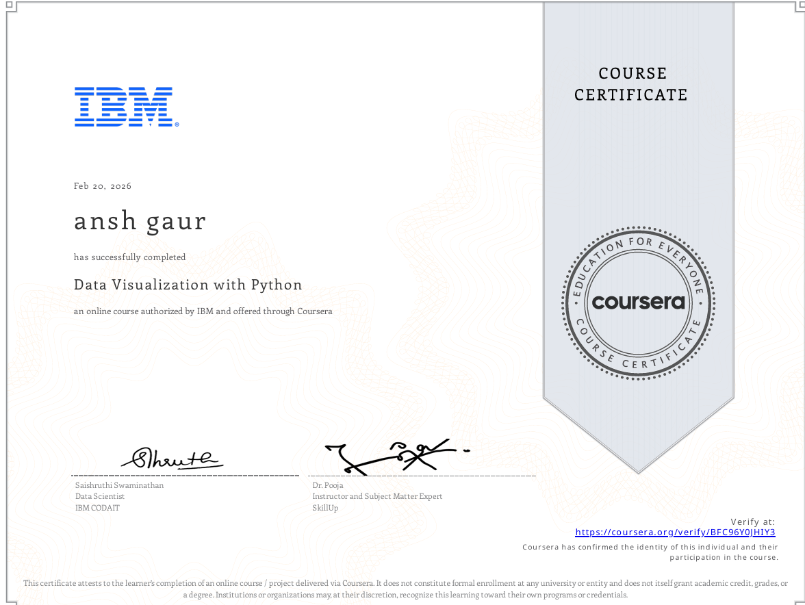
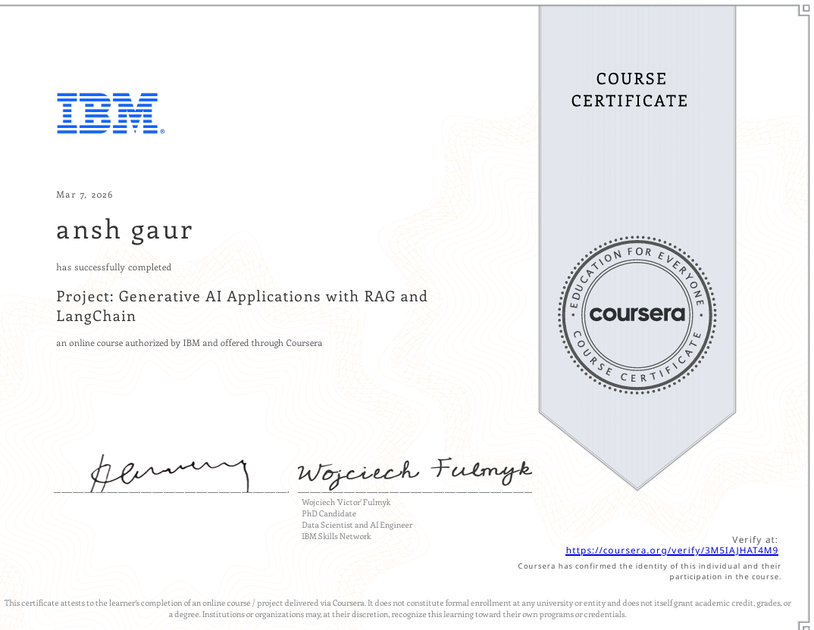
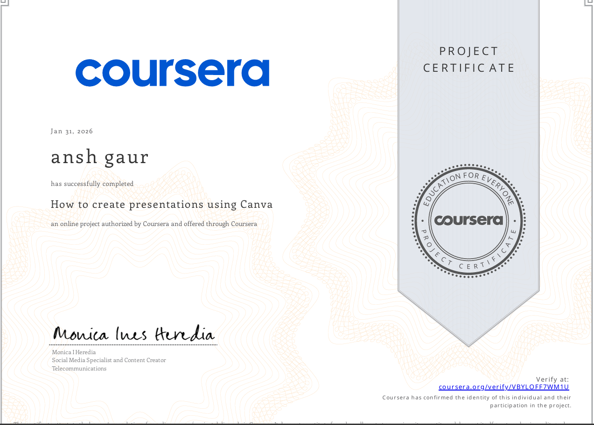
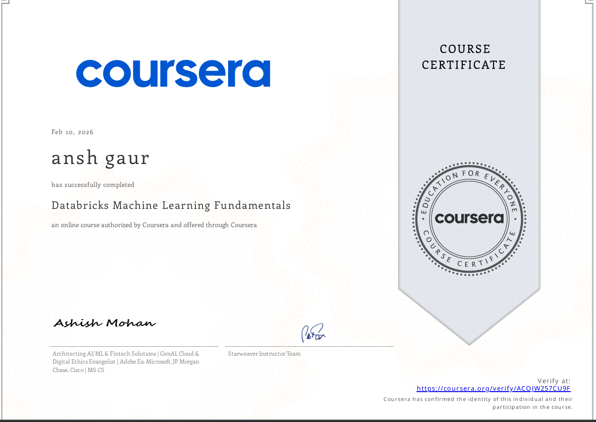
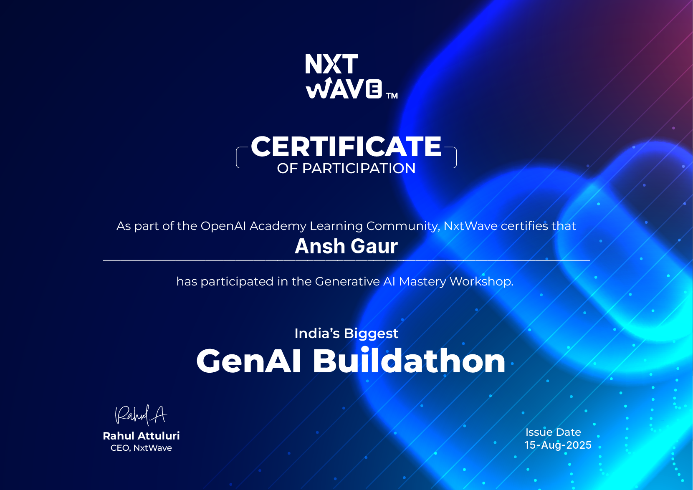
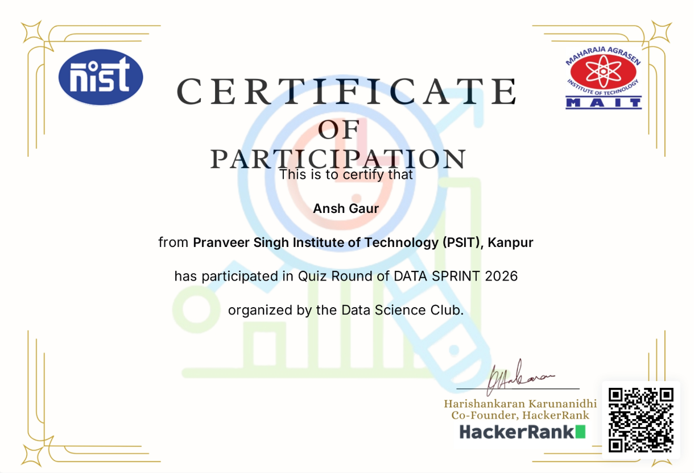
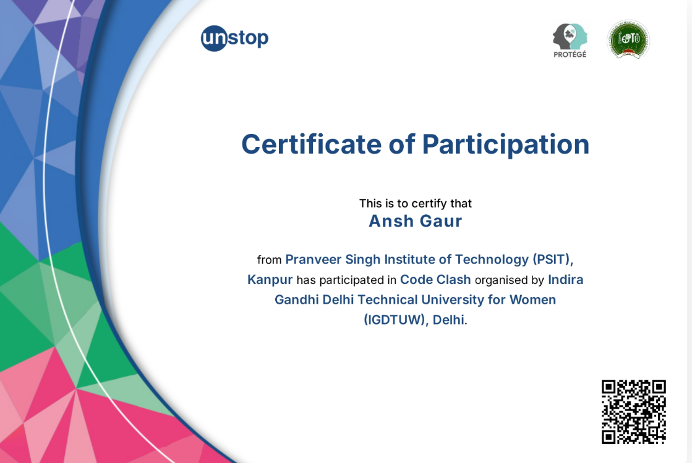
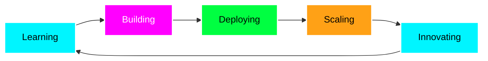

<!-- 🌌 Futuristic Header Banner -->
<div align="center">
  


<!-- Animated Title -->
<h1>
  
</h1>

<!-- Social Links with Neon Effect -->
<p>
  <a href="mailto:anshgaurx@gmail.com">
    
  </a>
  <a href="https://github.com/Anshxgaur">
    
  </a>
  <a href="https://www.linkedin.com/in/anshgaurx">
    
  </a>
  <a href="https://wa.me/919149162265">
    
  </a>
  <a href="https://leetcode.com/anshgaurx/">
    
  </a>
</p>

<!-- Visitor Counter & Stats -->
<p>
  
  
</p>

</div>

---

<!-- 🚀 Dynamic Introduction -->
<div align="center">
  
## 🧬 About Me

```typescript
const anshGaur = {
    location: "Meerut, India 🇮🇳",
    role: "AI Engineer",
    expertise: ["Machine Learning", "Data Science", "Automation"],
    currentFocus: "Building AI-powered healthcare solutions",
    learning: ["Advanced Deep Learning", "MLOps", "Cloud Architecture"],
    funFact: "ITS ALWAYS YOU VS YOU"
};
```


</div>

---

<!-- 🔥 GitHub Stats Dashboard -->
<div align="center">

## ⚡ GitHub Analytics


</div>

---

<!-- 🎯 Featured Projects -->
<div align="center">

## 🚀 Featured Projects

</div>

<table>
<tr>
<td width="50%">

### 🌼 DAISY - Healthcare Intelligence System(progres...)
<a href="#"></a>

**An AI-powered healthcare analytics platform**

🎯 **Core Features:**
- 🏥 **Disease Prediction Engine** - ML models for Heart Disease & Diabetes
- 📊 **Real-time Dashboard** - Interactive Streamlit visualizations
- 🎯 **Risk Stratification** - Patient categorization by urgency
- 📈 **Outbreak Forecasting** - Predictive analytics for epidemics

**Tech Stack:**
```python
Python | Streamlit | Scikit-learn | Pandas
NumPy | Plotly | Seaborn
```

<details>
<summary><b>🚀 Quick Start</b></summary>

```bash
git clone https://github.com/anshxgaur/DAISY.git
cd DAISY
python -m venv venv
source venv/bin/activate  # or venv\Scripts\activate on Windows
pip install -r requirements.txt
streamlit run app.pyy
```
</details>

</td>
<td width="50%">

### 🗣️ NOVA - Voice Automation Assistant
<a href="https://github.com/AnshGaur/NOVA"></a>

**Intelligent desktop automation through voice**

🎯 **Core Features:**
- 🎚️ **System Control** - Voice-activated volume & brightness
- 🌐 **Web Automation** - Hands-free browsing & search
- 🖱️ **Gesture Control** - Mouse automation via voice
- ⌨️ **Voice Typing** - Dictation & text input

**Tech Stack:**
```python
Python | SpeechRecognition | PyTTSx3
PyAutoGUI | PyAudio
```

<details>
<summary><b>🚀 Quick Start</b></summary>

```bash
git clone https://github.com/anshxgaur/NOVA.git
cd NOVA
python -m venv venv
source venv/bin/activate  # or venv\Scripts\activate on Windows
pip install -r requirements.txt
python app.py
```
</details>

</td>
</tr>

<tr>
<td width="50%">

### 🏎️ F1 Performance Analysis Dashboard
<a href="https://github.com/AnshGaur/F1"></a>

**Real-time F1 telemetry analysis system**

🎯 **Core Features:**
- 📊 **Live Telemetry** - Real-time race data visualization
- 🏁 **Performance Metrics** - Driver & team comparisons
- 📈 **Predictive Analytics** - Race outcome forecasting
- 🎯 **Strategy Simulation** - Pit stop optimization

**Tech Stack:**
```python
Python | Streamlit | FastF1 API
Plotly | Pandas | NumPy
```
<details>
<summary><b>🚀 Quick Start</b></summary>

```bash
git clone https://github.com/anshxgaur/F1.git
cd F1
python -m venv venv
source venv/bin/activate  # or venv\Scripts\activate on Windows
pip install -r requirements.txt
python app.py
npm run dev
```
</details>
</td>
<td width="50%">

### 🏢 NEXUS - Corporate Ecosystem
<a href="#"></a>

**Enterprise-grade workflow automation**

🎯 **Core Features:**
- 📋 **Task Management** - AI-powered project planning
- 👥 **Team Collaboration** - Real-time communication
- 📊 **Analytics Dashboard** - Performance insights
- 🤖 **Smart Automation** - Workflow optimization

**Tech Stack:**
```python
Python | FastAPI | React | PostgreSQL
Redis | Docker | Kubernetes
```
<details>
<summary><b>🚀 Quick Start</b></summary>

```bash
git clone https://github.com/anshxgaur/nexus.git
cd nexus
python -m venv venv
source venv/bin/activate  # or venv\Scripts\activate on Windows
pip install -r requirements.txt
python app.py
npm run dev
```
</details>

</td>
</tr>
</table>

---

<!-- 💻 Tech Arsenal -->
<div align="center">

## 🛠️ Tech Arsenal

### Languages & Frameworks
<p>


</p>

### Data Science & ML
<p>


</p>

### Tools & Platforms
<p>


</p>

### Cloud & DevOps
<p>


</p>

</div>

---

<!-- 🏆 Certifications Showcase -->
<div align="center">
  <h2>🎓 Certifications & Badges</h2>
  

  <h3>📊 IBM Data Science</h3>
  <p>13 Certificates</p>
  <table align="center">
    <tr>
      <td align="center"><br/><sub><b>What is Data Science?</b></sub></td>
      <td align="center"><br/><sub><b>Tools for Data Science</b></sub></td>
      <td align="center"><br/><sub><b>Data Science Methodology</b></sub></td>
      <td align="center"><br/><sub><b>Python for Data Science</b></sub></td>
      <td align="center"><br/><sub><b>PYTHON PROJECTS</b></sub></td>
    </tr>
    <tr>
      <td align="center"><br/><sub><b>Databases and SQL</b></sub></td>
      <td align="center"><br/><sub><b>Data Analysis with Python</b></sub></td>
      <td align="center"><br/><sub><b>Visualization</b></sub></td>
      <td align="center"><br/><sub><b>Machine Learning</b></sub></td>
      <td align="center"><br/><sub><b>Applied Data Science Capstone</b></sub></td>
    </tr>
    <tr>
      <td align="center"><br/><sub><b>Elevate Your Career</b></sub></td>
      <td align="center"><br/><sub><b>Career Guide</b></sub></td>
      <td align="center"><br/><sub><b>IBM Data Science Certificate</b></sub></td>
      <td></td>
      <td></td>
    </tr>
  </table>

  <br>

  <h3>🤖 IBM Generative AI Engineering</h3>
  <p>17 Certificates</p>
  <table align="center">
    <tr>
      <td align="center"><br/><sub><b>Introduction to AI</b></sub></td>
      <td align="center"><br/><sub><b>Gen AI: Intro & Applications</b></sub></td>
      <td align="center"><br/><sub><b>Prompt Engineering Basics</b></sub></td>
      <td align="center"><br/><sub><b>Python for Data Science</b></sub></td>
      <td align="center"><br/><sub><b>AI Apps with Flask</b></sub></td>
    </tr>
    <tr>
      <td align="center"><br/><sub><b>Gen AI-Powered Apps</b></sub></td>
      <td align="center"><br/><sub><b>Data Analysis with Python</b></sub></td>
      <td align="center"><br/><sub><b>Machine Learning</b></sub></td>
      <td align="center"><br/><sub><b>Deep Learning with Keras</b></sub></td>
      <td align="center"><br/><sub><b>LLMs Architecture</b></sub></td>
    </tr>
    <tr>
      <td align="center"><br/><sub><b>NLP Foundational Models</b></sub></td>
      <td align="center"><br/><sub><b>Language Modeling</b></sub></td>
      <td align="center"><br/><sub><b>Fine-Tuning Transformers</b></sub></td>
      <td align="center"><br/><sub><b>Advanced Fine-Tuning</b></sub></td>
      <td align="center"><br/><sub><b>AI Agents w/ RAG</b></sub></td>
    </tr>
    <tr>
      <td align="center"><br/><sub><b>Project: RAG & LangChain</b></sub></td>
      <td align="center"><br/><sub><b>IBM Gen AI Certificate</b></sub></td>
      <td></td>
      <td></td>
      <td></td>
    </tr>
  </table>

  <br>

  <h3>⚙️ Gen AI for Data Engineering</h3>
  <p>4 Certificates</p>
  <table align="center">
    <tr>
      <td align="center"><br/><sub><b>Gen AI Intro & Application</b></sub></td>
      <td align="center"><br/><sub><b>Gen AI Prompt Engineering</b></sub></td>
      <td align="center"><br/><sub><b>Gen AI Elevate Your Career</b></sub></td>
      <td align="center"><br/><sub><b>Final Gen AI Certificate</b></sub></td>
    </tr>
  </table>

  <br>

  <h3>🏅 Additional Certifications</h3>
  <p>10 Certificates</p>
  <table align="center">
    <tr>
      <td align="center"><br/><sub><b>Maths for Machine Learning</b></sub></td>
      <td align="center"><br/><sub><b>Maths for Computer Science</b></sub></td>
      <td align="center"><br/><sub><b>Databricks ML Fundamentals</b></sub></td>
      <td align="center"><br/><sub><b>Linear Regression w/ Python</b></sub></td>
      <td align="center"><br/><sub><b>Gen AI Transform Organization</b></sub></td>
    </tr>
    <tr>
      <td align="center"><br/><sub><b>Gen AI Transform Organization</b></sub></td>
      <td align="center"><br/><sub><b>DATABRICKS For ML</b></sub></td>
      <td align="center"><br/><sub><b>How to create presentation</b></sub></td>
      <td align="center"><br/><sub><b>Databricks Machine Learning</b></sub></td>
      <td align="center"><br/><sub><b>Snowflake for Data Science</b></sub></td>
    </tr>
  </table>

  <br>

  <h3>🏆 Hackathons</h3>
  <p>6 Certificates</p>
  <table align="center">
    <tr>
      <td align="center"><br/><sub><b>IISC BANGALORE</b></sub></td>
      <td align="center"><br/><sub><b>NIT DURGAPUR</b></sub></td>
      <td align="center"><br/><sub><b>OPEN AI</b></sub></td>
      <td align="center"><br/><sub><b>DATA SPRINT</b></sub></td>
      <td align="center"><br/><sub><b>GGSIPU</b></sub></td>
      <td align="center"><br/><sub><b>IGDTUW</b></sub></td>
    </tr>
  </table>
</div>
---

<!-- 🎮 Competitive Programming -->
<div align="center">

## 🎯 Competitive Programming

<table>
<tr>
<td align="center" width="50%">

### 🟠 LeetCode Stats


</td>
<td align="center" width="50%">

### 🟢 Coding Platforms
<br>

[](https://leetcode.com/anshgaurx/)
[](https://www.hackerrank.com/anshgaurx)
<br><br>

**Problem Solving:**
- ✅ 200+ Problems Solved
- 🏆 -
- 🥇 Top 25% Global Rank

</td>
</tr>
</table>

</div>

---

## 📈 Contribution Graph


### 🐍 Contribution Snake
<picture>
  <source media="(prefers-color-scheme: dark)" srcset="https://raw.githubusercontent.com/anshxgaur/anshxgaur/output/github-contribution-grid-snake-dark.svg">
  <source media="(prefers-color-scheme: light)" srcset="https://raw.githubusercontent.com/anshxgaur/anshxgaur/output/github-contribution-grid-snake.svg">
  
</picture>
</div>
🏙️  3D Contribution Graph
<p align="center">
  
</p>
📊 GitHub Metrics


---

<!-- 🌟 What I'm Up To -->
<div align="center">

## 🚀 Current Focus



### 🎯 2026 Goals
- 🤖 Build 5 production-grade AI applications
- 📚 Contribute to 10+ open source projects
- 🏆 Achieve 2000+ rating on LeetCode
- 🎓 Complete Advanced MLOps certification
- 🌐 Launch personal tech blog

</div>

---

<!-- 💬 Let's Connect -->
<div align="center">

## 💬 Let's Connect & Collaborate!

<p>
I'm always excited to collaborate on innovative projects, especially in:
<br><br>
🤖 <b>AI/ML Applications</b> | 🏥 <b>Healthcare Tech</b> | 🎙️ <b>Voice Automation</b> | 📊 <b>Data Analytics</b>
</p>

### 📫 Reach Out
<p>
<a href="mailto:anshgaurx@gmail.com">
  
</a>
<a href="https://www.linkedin.com/in/anshgaurx">
  
</a>
<a href="https://wa.me/919149162265">
  
</a>
</p>


</div>

<!-- 🌊 Footer Wave -->


---

<div align="center">

**⭐️ From [anshxgaur](https://github.com/anshxgaur) | Last Updated: April 2026**


</div>
