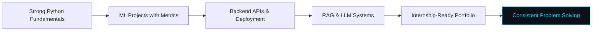

 

---

# 👋 About Me

I'm a **3rd-year Computer Science Engineering (Data Science)** student at **PSIT Kanpur**.

I enjoy building practical systems at the intersection of:

- 🤖 Machine Learning
- 📊 Data Science & Analytics
- 🧠 Generative AI
- 🔎 RAG & Semantic Search
- ⚙️ Python & Backend Engineering

My goal is to build strong, production-oriented projects and become internship-ready for **AI/ML Engineering, Data Science, Python Backend, and Generative AI roles**.

| Focus | Current Direction |
|---|---|
| 🎓 Education | B.Tech CSE — Data Science |
| 🧰 Core Stack | Python, SQL, TypeScript, FastAPI, Flask |
| 📊 Data | Pandas, NumPy, Scikit-learn, visualization |
| 🤖 AI | Machine Learning, NLP, RAG, Local LLM systems |
| 🔎 Interests | AI systems, semantic search, analytics products |
| 🚀 Goal | AI/ML, Data Science, GenAI & Backend internships |

---

# 🧠 Project Terminal

  
    <code>PROJECTS.SYS</code> — Systems, AI architectures, data products & experiments
  

  

<b>▶ OPEN PROJECT TABLE</b> <i>(Click to expand)</i>

 

| Project | What It Solves | Tech / Concepts | Why It Matters |
|---|---|---|---|
| **[Nexus Workspace](https://github.com/anshxgaur/nexus)** | Self-hosted AI-powered corporate workspace with team chat, meetings, live transcription, RAG search, and task extraction. | FastAPI, React, Tauri, TailwindCSS, Zustand, PostgreSQL, Redis, Qdrant, Whisper, LiveKit, Ollama, WebSockets | Shows system design thinking: backend APIs, real-time communication, vector search, local LLM integration, and multi-service architecture. |
| **[VISTA](https://github.com/anshxgaur/VISTA)** | Healthcare data intelligence system for EDA, disease prediction, risk stratification, and clinical decision support (heart disease & diabetes risk modeling, real-time patient vitals dashboard). | Python, Pandas, NumPy, Scikit-learn, Streamlit, Matplotlib, Seaborn, ML pipelines | Strong fit for data science internships because it connects ML models to a real domain problem with interpretable outcomes. |
| **[NOVA](https://github.com/anshxgaur/NOVA)** | Personal AI assistant architecture focused on local inference, voice interaction, security checks, and task orchestration. | TypeScript, AI architecture, STT/TTS pipeline, prompt-injection defense, modular orchestration | Demonstrates interest in GenAI beyond prompting: local-first design, secure AI flow, and agent-like task routing. |
| **[F1 Data Analytics](https://github.com/anshxgaur/F1)** | Formula 1 analytics platform for tire degradation, pit-window reasoning, and driver performance comparison. | TypeScript, Next.js, data visualization, analytics dashboards, strategy modeling | Shows you can turn complex datasets into interactive decision-support products. |
| **[ASTRA](https://github.com/anshxgaur/astra)** | AI-powered unified search platform — merges 1,000 resumes, 20 research papers, and 6 fragmented AICTE data sources into one semantic search + RAG Q&A portal. | FastAPI, PostgreSQL + pgvector, fastembed, Groq LLM (text-to-SQL + RAG), Docker | Shows full-stack AI system design: vector search at scale, hybrid retrieval, and turning messy multi-source data into a usable product. |

 

  

# 🛠️ What I Build

<table>
<tr>

<td width="33%" align="center">

### 🔬 Machine Learning

EDA, preprocessing, feature engineering, model training, evaluation, and deployment-oriented ML workflows.

</td>

<td width="33%" align="center">

### 🧠 LLM & RAG Systems

Embeddings, vector search, semantic retrieval, local LLM workflows, and AI-powered assistants.

</td>

<td width="33%" align="center">

### 📊 Data Products

Dashboards, analytics tools, visual reports, and backend systems that make data easier to use.

</td>

</tr>
</table>

---

# 💻 Tech Stack

---

# 🧩 Problem Solving

---

# 📊 GitHub Activity

<picture>

<source media="(prefers-color-scheme: dark)" srcset="https://raw.githubusercontent.com/anshxgaur/anshxgaur/output/pacman-contribution-graph-dark.svg">

<source media="(prefers-color-scheme: light)" srcset="https://raw.githubusercontent.com/anshxgaur/anshxgaur/output/pacman-contribution-graph.svg">

</picture>

---

# 🏆 Hackathons & Certifications

## 🚀 Hackathons

<b>▶ HACKATHONS</b> <i>(Click to expand)</i>

 

<table>

<tr>

<td width="25%" align="center">

 
<b>AI / Data Science</b>
</td>

<td width="25%" align="center">

 
<b>ML / GenAI</b>
</td>

<td width="25%" align="center">

 
<b>Hackathon</b>
</td>

<td width="25%" align="center">

 
<b>IGDTU Event</b>
</td>

</tr>

<tr>

<td width="25%" align="center">

 
<b>IISc Bangalore</b>
</td>

<td width="25%" align="center">

 
<b>NIT Durgapur</b>
</td>

<td width="25%" align="center">

 
<b>NIT Durgapur — DataSprint</b>
</td>

<td width="25%" align="center">

 
<b>Quizz Off</b>
</td>

</tr>

</table>

🥉 <b>3rd Position</b> — GGSIPU Hackathon, HACKXTREME

 

Participant in events including PROTODASH at IISc Bangalore, CODEFEST at NIT Durgapur, and ECLIPSE 6.0 at Thapar Institute.

 

## 📜 IBM Data Science Certifications

<b>▶ IBM DATA SCIENCE CERTIFICATIONS</b> <i>(Click to expand)</i>

 

<table>

<tr>

<td width="25%" align="center">

 
<b>What is Data Science?</b>
</td>

<td width="25%" align="center">

 
<b>Tools for Data Science</b>
</td>

<td width="25%" align="center">

 
<b>Data Science Methodology</b>
</td>

<td width="25%" align="center">

 
<b>Python for Data Science, AI & Development</b>
</td>

</tr>

<tr>

<td width="25%" align="center">

 
<b>Python Project for Data Science</b>
</td>

<td width="25%" align="center">

 
<b>Databases & SQL for Data Science</b>
</td>

<td width="25%" align="center">

 
<b>Data Analysis with Python</b>
</td>

<td width="25%" align="center">

 
<b>Data Visualization with Python</b>
</td>

</tr>

<tr>

<td width="25%" align="center">

 
<b>Machine Learning with Python</b>
</td>

<td width="25%" align="center">

 
<b>Applied Data Science Capstone</b>
</td>

<td width="25%" align="center">

 
<b>GenAI: Elevate Your Data Science Career</b>
</td>

<td width="25%" align="center">

 
<b>Data Scientist Career Guide</b>
</td>

</tr>

<tr>

<td width="25%" align="center">

 
<b>IBM Data Science</b>
</td>

<td width="25%"></td>
<td width="25%"></td>
<td width="25%"></td>

</tr>

</table>

---

# 🎯 Current Mission

```mermaid
flowchart LR
    A[Strong Python Fundamentals] --> B[ML Projects with Metrics]
    B --> C[Backend APIs & Deployment]
    C --> D[RAG & LLM Systems]
    D --> E[Internship-Ready Portfolio]
    E --> F[Consistent Problem Solving]

    style F fill:#0D1117,stroke:#00D9FF,color:#00D9FF
```

---

# 📬 Let's Connect

<b>Open to AI/ML, Data Science, Python Backend, and Generative AI internship opportunities.</b>

  

<a href="mailto:anshgaurx@gmail.com">Email</a>
&nbsp; • &nbsp;
<a href="https://www.linkedin.com/in/ansh-gaur-46b7a4378/">LinkedIn</a>
&nbsp; • &nbsp;
<a href="https://github.com/anshxgaur">GitHub</a>
&nbsp; • &nbsp;
<a href="https://leetcode.com/u/anshgaurx/">LeetCode</a>

  

 

## Daily AI Insight

<!--QUOTE-START-->

  

<!--QUOTE-END-->

