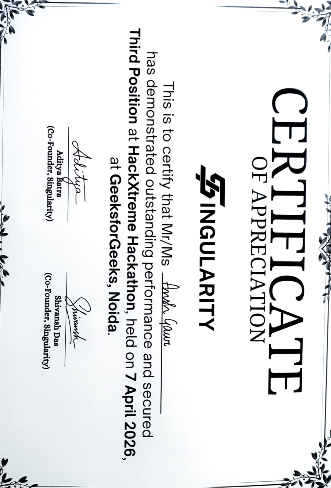
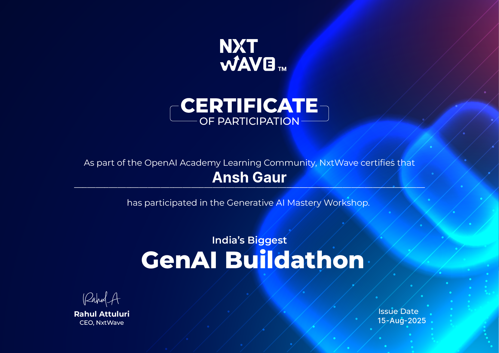
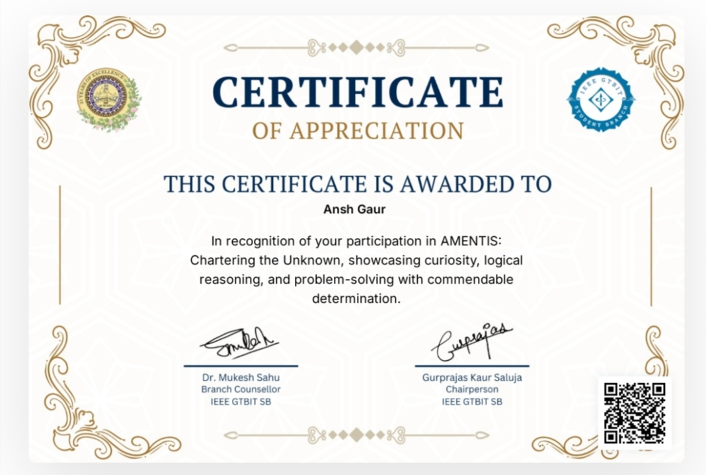
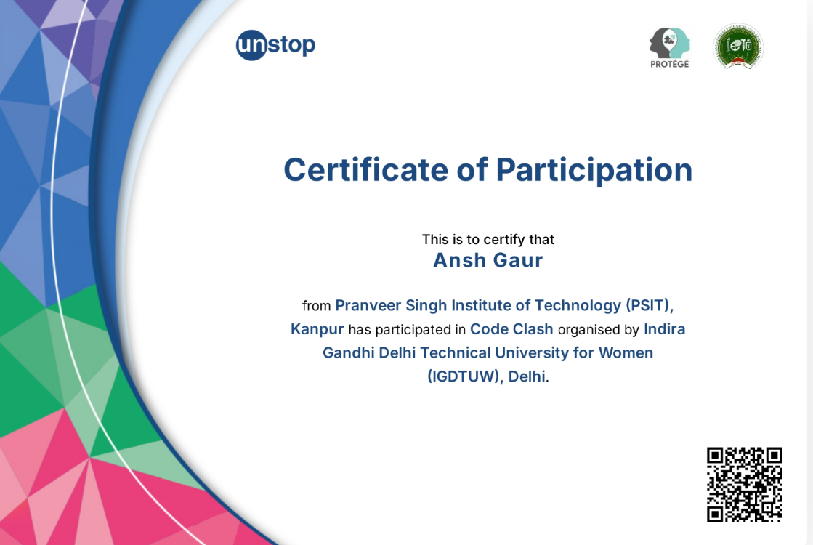
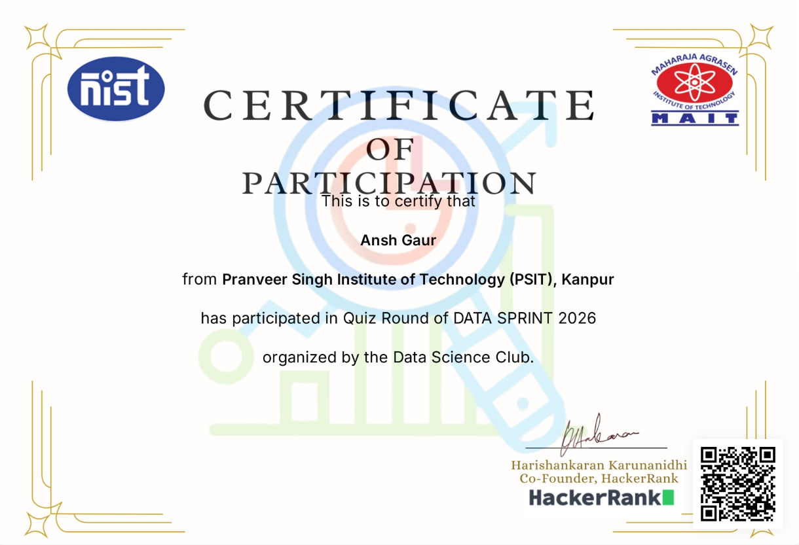
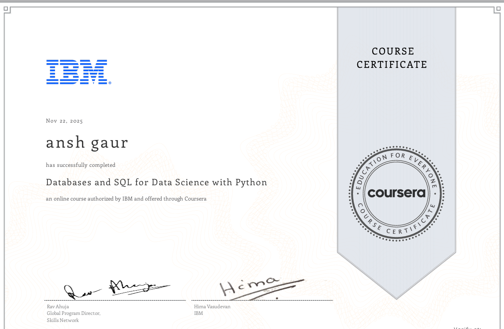
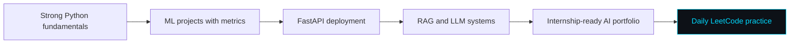

 

## ⚡ About Me

B.Tech Computer Science and Engineering (Data Science) student, 3rd-year, at **PSIT Kanpur**. I build practical AI systems with Python, machine learning, FastAPI, data pipelines, dashboards, and early-stage LLM/RAG architectures.

My current focus is becoming internship-ready for **AI/ML Engineering, Data Science, Python Backend, and Generative AI** roles.

<table>
  <tr>
    <td>🎓 <b>Current stage</b></td>
    <td>3rd-year CSE – Data Science undergraduate</td>
  </tr>
  <tr>
    <td>🧰 <b>Core stack</b></td>
    <td>Python, SQL, TypeScript, FastAPI, Flask, Pandas, NumPy, Scikit-learn</td>
  </tr>
  <tr>
    <td>🤖 <b>AI interests</b></td>
    <td>Machine learning, NLP, anomaly detection, RAG, local LLM systems, analytics dashboards</td>
  </tr>
  <tr>
    <td>🌍 <b>Open to</b></td>
    <td>Remote internships and Delhi/NCR/Meerut/Kanpur office or hybrid internships</td>
  </tr>
</table>

## 🧠 Projects

| Project | What It Solves | Tech / Concepts | Why It Matters |
|---|---|---|---|
| **[Nexus Workspace](https://github.com/anshxgaur/nexus)** | Self-hosted AI-powered corporate workspace with team chat, meetings, live transcription, RAG search, and task extraction. | FastAPI, React, Tauri, TailwindCSS, Zustand, PostgreSQL, Redis, Qdrant, Whisper, LiveKit, Ollama, WebSockets | Shows system design thinking: backend APIs, real-time communication, vector search, local LLM integration, and multi-service architecture. |
| **[VISTA](https://github.com/anshxgaur/VISTA)** | Healthcare data intelligence system for EDA, disease prediction, risk stratification, and clinical decision support (heart disease & diabetes risk modeling, real-time patient vitals dashboard). | Python, Pandas, NumPy, Scikit-learn, Streamlit, Matplotlib, Seaborn, ML pipelines | Strong fit for data science internships because it connects ML models to a real domain problem with interpretable outcomes. |
| **[NOVA](https://github.com/anshxgaur/NOVA)** | Personal AI assistant architecture focused on local inference, voice interaction, security checks, and task orchestration. | TypeScript, AI architecture, STT/TTS pipeline, prompt-injection defense, modular orchestration | Demonstrates interest in GenAI beyond prompting: local-first design, secure AI flow, and agent-like task routing. |
| **[F1 Data Analytics](https://github.com/anshxgaur/F1)** | Formula 1 analytics platform for tire degradation, pit-window reasoning, and driver performance comparison. | TypeScript, Next.js, data visualization, analytics dashboards, strategy modeling | Shows you can turn complex datasets into interactive decision-support products. |
| **[DAISY](https://github.com/anshxgaur/DAISY)** | Voice-driven desktop automation companion — hands-free system control, web automation, and voice typing. | Python, voice automation, system control, web automation | Highlights applied AI outside pure data science: automation, hands-free UX, and practical scripting. |

## 🛠️ What I Build

<table>
  <tr>
    <td width="33%" align="center">
      <h3>🔬 Machine Learning Pipelines</h3>
      
EDA, preprocessing, feature engineering, model training, evaluation, and deployment-ready APIs.

    </td>
    <td width="33%" align="center">
      <h3>🧬 LLM and RAG Systems</h3>
      
Document search, embeddings, vector databases, prompt design, local LLM flows, and retrieval-based assistants.

    </td>
    <td width="33%" align="center">
      <h3>📊 Data Products</h3>
      
Dashboards, analytics workflows, visual reports, and API-backed tools that make data easier to act on.

    </td>
  </tr>
</table>

## 💻 Tech Stack

  

  
  
  
  
  
  
  

## 🎯 Internship Fit

| Target Role | I Can Show | Next Skill I Am Sharpening |
|---|---|---|
| AI/ML Intern | ML pipelines, anomaly detection, healthcare analytics, model evaluation | Better experiment tracking and model comparison |
| GenAI / LLM Intern | RAG architecture, local LLM workflow, prompt-safety thinking | LangChain/LlamaIndex projects with vector search |
| Python Developer Intern | FastAPI/Flask APIs, automation scripts, data processing | Testing, Docker, and production-style API structure |
| Data Science Intern | EDA, visualizations, predictive modeling, SQL basics | Stronger SQL case studies and dashboard deployment |

## 🧩 LeetCode Progress

  

  
  

> Actively solving daily on [LeetCode](https://leetcode.com/u/anshgaurx/) — Dynamic Programming, Divide & Conquer, Hash Tables, and Binary Search are current focus tags. Card above updates automatically as new problems are solved.

## 📊 GitHub Analytics

  

  
  

  

### 🐍 Contribution Snake

<picture>
  <source media="(prefers-color-scheme: dark)" srcset="https://raw.githubusercontent.com/anshxgaur/anshxgaur/output/github-contribution-grid-snake-dark.svg" />
  <source media="(prefers-color-scheme: light)" srcset="https://raw.githubusercontent.com/anshxgaur/anshxgaur/output/github-contribution-grid-snake.svg" />
  
</picture>

<!-- CERTIFICATES-AND-HACKATHONS-START -->
## 🏆 Hackathons & Certifications

  
  

### 🚀 Hackathons

<table>
  <tr>
    <td width="25%" align="center">
      
       
      <b>AI / Data Science</b>
    </td>
    <td width="25%" align="center">
      
       
      <b>ML / GenAI</b>
    </td>
    <td width="25%" align="center">
      
       
      <b>Hackathon</b>
    </td>
    <td width="25%" align="center">
      
       
      <b>IGDTU Event</b>
    </td>
  </tr>
  <tr>
    <td width="25%" align="center">
      
       
      <b>IISc Bangalore</b>
    </td>
    <td width="25%" align="center">
      
       
      <b>NIT Durgapur</b>
    </td>
    <td width="25%" align="center">
      
       
      <b>NIT Durgapur — DataSprint</b>
    </td>
    <td width="25%" align="center">
      
       
      <b>Quizz Off</b>
    </td>
  </tr>
</table>

  <b>🥉 3rd Position</b> — GGSIPU Hackathon, HACKXTREME &nbsp;|&nbsp;
  <b>Participant:</b> PROTODASH IISc Bangalore, CODEFEST NIT Durgapur, ECLIPSE 6.0 Thapar Institute

 

### 📜 Certifications

  
<b>▶ IBM DATA SCIENCE</b> <i>(Click to expand certificates)</i>

   
  <table>
    <tr>
      <td width="25%" align="center">
        
         
        <b>What is Data Science?</b>
      </td>
      <td width="25%" align="center">
        
         
        <b>Tools for Data Science</b>
      </td>
      <td width="25%" align="center">
        
         
        <b>Data Science Methodology</b>
      </td>
      <td width="25%" align="center">
        
         
        <b>Python for Data Science, AI & Development</b>
      </td>
    </tr>
    <tr>
      <td width="25%" align="center">
        
         
        <b>Python Project for Data Science</b>
      </td>
      <td width="25%" align="center">
        
         
        <b>Databases & SQL for Data Science</b>
      </td>
      <td width="25%" align="center">
        
         
        <b>Data Analysis with Python</b>
      </td>
      <td width="25%" align="center">
        
         
        <b>Data Visualization with Python</b>
      </td>
    </tr>
    <tr>
      <td width="25%" align="center">
        
         
        <b>Machine Learning with Python</b>
      </td>
      <td width="25%" align="center">
        
         
        <b>Applied Data Science Capstone</b>
      </td>
      <td width="25%" align="center">
        
         
        <b>GenAI: Elevate Your Data Science Career</b>
      </td>
      <td width="25%" align="center">
        
         
        <b>Data Scientist Career Guide</b>
      </td>
    </tr>
    <tr>
      <td width="25%" align="center">
        
         
        <b>IBM Data Science</b>
      </td>
      <td width="25%"></td>
      <td width="25%"></td>
      <td width="25%"></td>
    </tr>
  </table>

<!-- CERTIFICATES-AND-HACKATHONS-END -->

## 🚀 Current Mission

```mermaid
flowchart LR
    A[Strong Python fundamentals] --> B[ML projects with metrics]
    B --> C[FastAPI deployment]
    C --> D[RAG and LLM systems]
    D --> E[Internship-ready AI portfolio]
    E --> F[Daily LeetCode practice]
    style F fill:#0D1117,stroke:#00D9FF,color:#00D9FF
```

<b>Open to AI/ML, Data Science, Python Developer, and GenAI internships.</b>
 
<a href="mailto:anshgaurx@gmail.com">anshgaurx@gmail.com</a> ·
<a href="https://www.linkedin.com/in/ansh-gaur-46b7a4378/">LinkedIn</a> ·
<a href="https://github.com/anshxgaur">GitHub</a> ·
<a href="https://leetcode.com/u/anshgaurx/">LeetCode</a>

<!--QUOTE-START-->

  

<!--QUOTE-END-->

